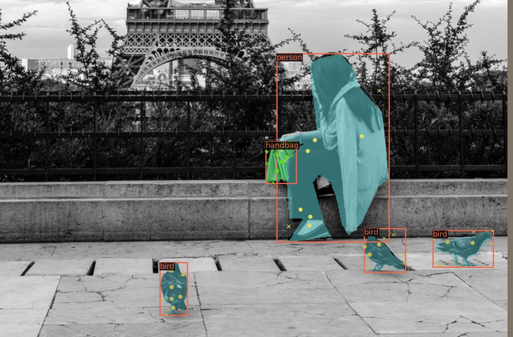

# Pointly-Supervised Instance Segmentation

implement with mmdetection



## requirement

mmdet

## usage

### train
``` bash
./dist_train.sh
```

### display labels

``` bash
python point_label_display.py configs/official/point_sup_r50_fpn_1x_coco.py --show-dir ./output
```

please follow official mmdetection instructions

## version

- offitial: modified from detectron2 [PointSup](https://github.com/facebookresearch/detectron2/tree/main/projects/PointSup)

- own: implementation from scratch with some features:
    - sample sites in batch
    - provide sample sites visual info
    - extend relative import for better decoupling with origin mmdetection project (without modifying origin package code)